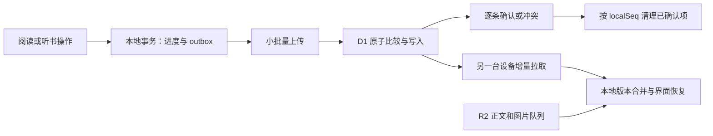

# PC / 移动端同步审计与修改方案

日期：2026-09-30，时间均为北京时间。审计基线：`1b050d6`。

结论：已复现进度漏传、听书位置回退、持续使用时同步延迟、断网恢复失效。现有 IndexedDB + Cloudflare D1/R2 可以继续使用，修复重点是进度写入、上传确认、同步调度和部署版本管理。

本轮完成代码审查、相关 Git 历史检查、Cloudflare 线上只读检查和隔离浏览器复现。业务代码和生产数据未修改。下文的“建议”是待实施方案，不代表已经上线。

## 1. 检查范围与线上事实

- 仓库：`https://github.com/Leo-youngk/MOTING`。应用目录：`E:\墨听APP\moting-reader`。
- 开始时分支：`claude/book-library-refresh-issue-3gzh8y`，工作区干净；审计交付分支：`codex/sync-audit-20260930`。
- 现有依赖使用原生 IndexedDB，没有 RxDB、PouchDB 或其他同步引擎。阅读位置在 `settings/reading-position:*`；听书位置在 `books.listeningPosition`；服务器分为 `positions`、`listening` 两张表。
- 查阅了 `7689265`、`448b360`、`7ebf623`、`0a500b9`、`44b616d` 的同步相关历史。保留现有记录级合并、独立读听位置、D1 批事务、正文按需读取和阅读器远端跳转提示。
- 使用本地 Git 忽略的 Cloudflare 凭据读取部署、绑定、已部署 Worker 源码、D1 和日志，没有把令牌值写入审计文件。

| 项目 | 已核实结果 |
| --- | --- |
| 主站 | `https://moting-reader.if5v.workers.dev`，部署于 2026-09-29 16:30:33；版本 `75090954-9422-4ff7-bb57-054358bc55b6` |
| 旧站 | `https://moting-reader.yk2958374240.workers.dev`，部署于 2026-09-23 11:48:30；版本 `68edad77-d5a9-4081-8224-964c73c487f9` |
| 同步后端 | 主站绑定 `moting-sync` D1、`moting-books` R2、`moting-audio` Queue；同步账号密钥绑定存在 |
| 旧站代理 | `SYNC_UPSTREAM` 指向主站；旧站自身没有同步 D1 绑定 |
| D1 | 地区 `WNAM`，读副本关闭；约 3.2 MB，不存在数据库容量接近上限的迹象 |
| D1 记录数 | books 37 条（含墓碑）、positions 24、listening 18、notes 241、sessions 208 |
| 日志样本 | 2026-09-29 18:51 至 2026-09-30 18:51，返回 33 个 `/api/sync/*` 事件，全部 HTTP 200、iPhone 请求；该样本未出现 Windows 请求 |
| 最新阅读记录 | 2026-09-30 18:10:52 保存，18:11:30 入库，相差约 37.4 秒 |

日志只能证明样本中的请求成功到达服务器，不能证明某条最新进度包含在请求体内，或另一台设备已经应用它。HTTP 200 也不代表服务端实际覆盖了已有记录：当前接口对 LWW 忽略的旧记录同样返回 200。

历史听书记录可见约 6 小时 13 分和 2 小时 20 分的“客户端记录时间到服务端接收时间”差距。这些记录发生于 9 月 29 日修复之前，不能当作最新版仍有同等延迟的直接证据；时间差也包含设备离线和时钟偏差的可能影响。

旧站与主站的已部署源码确实不同：旧站缺少 `sync_push_progress_failed`、远端位置跳转提示、`moting-reader-sync`、`pendingImages`、`pendingPush` 等特征，主站具备这些特征。当前尚未取得电脑端实际使用的网址，因此不能断言用户的电脑正在使用旧站。

本机直接访问两个 `workers.dev` 首页均返回 403；线上 UI 未验证。线上结论来自 Cloudflare 管理 API、部署源码及真实历史日志。没有向生产发送测试书、测试进度或制造测试会话。

## 2. 已确认的问题

### F01：完整同步可跳过尚在内存中的最新进度（P1，首先修复）

相关代码：`components/moting-app.tsx:6432`、`:6738`、`:7031`、`:7538`；`lib/sync.ts:165`、`:708`、`:865`。

阅读位置先保存在内存，约 2.5 秒后落盘；听书位置约 20 秒后落盘。`triggerSync()` 直接调用 `runSync()`，没有先排空这些待写位置。`runSync()` 用开始时刻作为新的全局 `pushedAt`，下轮仅收集修改时间大于该水位的记录。

因此可以出现：

1. `t1` 产生新进度，但还没有写进 IndexedDB。
2. `t2 > t1` 开始同步，扫描数据库时看不到这条新进度。
3. 同步完成，把 `pushedAt` 推进到 `t2`。
4. 延迟任务写入新进度，仍保留其真实修改时间 `t1`。
5. 后续扫描认为 `t1 <= pushedAt`，一直不上传，直到再次产生更晚的操作或做全量补传。

引擎复现：A 本地第 4 句、B 仍第 1 句，再同步也不补传；听书的新位置同样被跳过。真实页面复现：阅读位置第 45 句的 `savedAt=1790765923319`，同步水位为 `1790765923333`，后续上传集合中没有这条位置。

建议：短期让所有完整同步入口先执行并等待进度落盘，落盘失败时停止推进上传确认；长期以持久化待上传队列和本地序号代替 `修改时间 > 全局开始时间` 的判断。仅加一次 flush 无法彻底解决“同步过程中迟到的写入”及设备时钟回拨。

### F02：延迟的本地听书保存会覆盖更晚的远端位置（P1）

相关代码：`components/moting-app.tsx:7031`；`lib/storage.ts:420`、`:440`。

远端听书位置使用 `updateListeningIfNewer()`，在事务内比较位置时间；本地延迟写入却使用 `updateBookMeta()`，直接覆盖 `listeningPosition`。同步拉回的新位置可能被之前积攒的旧位置盖掉。

复现：先拉到第 8 句，再落盘旧的第 2 句，本地退回第 2 句；下一轮同步仍停在第 2 句，因为云端较新位置已经被拉取游标越过。

另一个相关风险：`saveReadingPositions()` 会正确拒绝旧写入，但没有返回哪些条目实际保存；`flushReadingProgress()` 无论是否写入，都把原条目放回 React 状态。这会造成数据库保留新位置、书架内存却显示旧位置。此项为代码审查确认的竞争条件，尚未单独复现 UI 的瞬时回退。

建议：本地和远端统一走带版本比较的进度事务；返回实际保存的记录，UI 只应用成功保存的版本。远端更新落地时协调尚未写入的本地进度；发生并发操作时保留候选位置并明确处理冲突。

### F03：持续阅读/听书会一直推迟自动同步（P1）

相关代码：`components/moting-app.tsx:6658`、`:6686`、`:7055`、`:7266`。

30 秒计时器依赖整个 `books/notes/chats/settings/sessions` 状态，每次变化都会取消并重设。阅读滚动、听书逐句回调、真实阅读计时都能触发变化。现有 5 分钟轮询才是持续操作期间的兜底，而且只在页面可见时运行；接收端也依赖同一轮询或回前台事件。

真实页面每 5 秒继续滚动、持续 40 秒：发出的 push 和 pull 都是 0。已有测试只验证切后台、回前台和手动同步，没有覆盖持续使用。

建议：按数据库实际写入调度进度上传，采用节流或带 `maxWait` 的防抖；每 5 秒以内处理一批最新进度。阅读/播放器在前台时每 5–10 秒检查云端版本，仅有变更时拉取；空闲书架可降低频率。手动同步、退出阅读器、暂停、切后台应立即排队。

### F04：开机断网和失败后的网络恢复处理不完整（P1）

相关代码：`components/moting-app.tsx:6475`、`:6484`、`:6639`、`:6667`。

开机 `getSyncSession()` 一旦失败，异常被直接吞掉，`syncConnected` 留在 false；网络恢复监听又只在 `syncConnected` 为 true 时注册。浏览器 Cookie 仍然有效，页面却显示登录表单，并且不会自动重查。

另外，`lastSyncEndRef` 在同步失败时也更新；网络恢复和回前台会按这个时刻做 10 秒过滤，误跳过必要的重试。失败期间收到的 `syncAgainRef` 也会在 finally 中清掉。

复现一：开机模拟一次 session 503，随后触发 online，2 秒内没有 session/push/pull；页面仍显示未登录，而直接读 session 返回 `connected:true`。

复现二：一次 pull 503 后立即恢复网络并触发 online，pull 次数不增加，失败提示仍保留。

建议：区分“未登录”和“会话状态暂时未知”；网络恢复无条件重查会话，401 才转入需要登录的状态。仅以成功拉取时间做重复事件节流；失败后退避重试，online/resume 立即唤醒待执行任务。

### F05：进度被正文/图片任务阻塞，部分失败又可能显示完成（P1/P2）

相关代码：`lib/sync.ts:352`、`:708`、`:734`、`:779`、`:807`、`:834`、`:875`；`components/moting-app.tsx:6465`。

完整同步的顺序是“推记录 → 串行上传未完成书籍 → 拉取 → 下载新书和图片 → 应用听书位置”。正文请求超时可长达 300 秒；即使对端听书位置已经拉到，也要等前面的下载和图片重试完成才应用。

上传遇到暂时错误会进入 `stillPending`，但返回结果没有携带待重试数量。复现中一本书的正文 HEAD 返回 503，`pendingContent=1` 且没有 ready 标记，结果却为 `failedContent=[]、skipped=0、syncedAt>0`。UI 因而可能显示“同步完成”。

后台 `pushPending()` 还会收集书目、笔记和聊天等全部脏记录。当前分包上限约 6 MB，超过 60 KB 就禁用 keepalive，可能让最后一条小进度跟在大聊天后面。此项为源码确认的运行风险，没有在真实 iPhone 冻结期间复现。

建议：进度单独走小请求和独立确认，正文/图片使用持久化资源队列；听书位置可立即应用到已有书，新书位置在下载完成后补套。后台优先发送阅读/听书位置，按 UTF-8 实际字节计算包大小，限制同时在途的 keepalive 总量。UI 区分“进度已同步”“资源待重试”“部分失败”，失败不能计为完整成功。

### F06：两个公开入口运行不同代客户端（P1，发布时必须处理）

相关代码：`scripts/legacy-config.mjs`、`worker/sync.ts:430`、`public/sw.js`、`hooks/use-app-update.ts`。

旧站只是把 API 转发到主站，前端版本仍停在 9 月 23 日。它没有最近的后台进度推送、远端位置提示和本地重试队列修复。两端即使使用同一同步账号和同一 D1，也可能运行不同的保存与同步逻辑。

建议：同一发布同时更新两个入口，提供可读取的 build/protocol/backend 标识用于核验。保留旧域名存储和同源代理，先确认旧域名数据上传完毕，再引导迁移。直接换域名无法迁移 IndexedDB。

当前 legacy 构建脚本只删除 D1/R2 配置，仍会保留后来新增的 Queue producer/consumer 配置；旧站当前部署只具有 fetch handler。下一次更新旧站时需要修正或验证这一配置，确保同步与媒体端点均转发到主站。

### F07：客户端墙上时钟仍同时决定保存和冲突胜负（P2，协议修复）

相关代码：`lib/storage.ts:730`、`lib/sync-merge.ts:224`、`:239`、`worker/sync-store.ts:153`、`worker/sync.ts:161`。

当前的位置比较、脏数据筛选和服务器 LWW 都依赖客户端 `Date.now()`；只限制“超过服务端一天的未来时间”，没有解决正常范围的偏差或回拨。相同毫秒的不同修改也没有稳定的区分方式。

复现把客户端时间回拨 10 分钟后，新产生的第 7 句位置被保存比较拒绝，本地仍是第 4 句，并且不会出现在上传集合。此为故障注入验证，不代表用户的真实设备已发生时钟回拨。

建议：本地用持久化单调 `localSeq` 排序写入；进度同步复用服务端 `server_at` 作为记录版本，在 push 中携带已知的 `baseServerRev` 和稳定 mutation 标识。服务端事务内比较版本并返回逐条确认或当前冲突记录。真实重读/拖动可以回到前面的章节，不能简单取最大的百分比。

## 3. 开源方案调查与采用理由

已实际阅读官方协议说明、关键代码和许可证，并查询 GitHub 仓库维护状态。调查截至本次审计日期。

| 候选 | 核实结果 | 本项目的采用方式 |
| --- | --- | --- |
| RxDB | 核心 Apache-2.0，仓库未归档，GitHub API 显示最近推送为 2026-09-30；官方列出 17.5.0 发布。协议包含 checkpoint、客户端假定的服务端状态、冲突响应和断网重同步。专用 IndexedDB storage 属于 Premium；直接接入需迁移当前存储模型 | 借鉴有确认的复制与冲突协议，保留现有 IndexedDB/D1 结构 |
| PouchDB | Apache-2.0，仓库未归档，最近推送为 2026-09-13；官方发布页可见 9.0.0。已阅读 checkpoint 源码，它先更新目标端 checkpoint，再更新源端，避免失败后跳过数据；完整复制通常需要兼容 CouchDB 的后端 | 采用“目标端确认后才能推进源端确认”的规则，避免迁移成 CouchDB 协议 |
| 现有 D1/R2 | 已有单用户鉴权、R2 正文和 D1 事务游标，现有协议/多设备测试通过。D1 未使用 Sessions API，按官方文档仍走主库；本次 SQL 也返回 `served_by_primary:true` | 保留现有服务，补充逐条确认和进度版本比较 |

需要自行实现的部分：与现有写入函数同事务的 outbox、进度调度、服务端确认/冲突处理、恢复阅读器时的版本协调、双入口发布核验及 iPhone 真机验收。这些部分直接适配现有产品行为。

来源：

- [RxDB 同步协议与示例](https://rxdb.info/replication.html)、[upstream 实现](https://github.com/pubkey/rxdb/blob/master/src/replication-protocol/upstream.ts)、[许可证](https://github.com/pubkey/rxdb/blob/master/LICENSE.txt)、[发布记录](https://github.com/pubkey/rxdb/releases)。
- [RxDB IndexedDB storage 的运行和授权条件](https://rxdb.info/rx-storage-indexeddb.html)。
- [PouchDB 复制说明](https://pouchdb.com/guides/replication.html)、[checkpoint 实现](https://github.com/apache/pouchdb/blob/master/packages/node_modules/pouchdb-checkpointer/src/index.js)、[许可证](https://github.com/apache/pouchdb/blob/master/LICENSE)、[发布记录](https://github.com/apache/pouchdb/releases)。
- [D1 batch 与 Sessions API](https://developers.cloudflare.com/d1/worker-api/d1-database/)、[D1 读副本规则](https://developers.cloudflare.com/d1/best-practices/read-replication/)。
- [浏览器页面生命周期](https://developer.chrome.com/docs/web-platform/page-lifecycle-api)、[Fetch Standard](https://fetch.spec.whatwg.org/)：后台页面可能冻结/销毁，keepalive 有请求体总量约束，不能把页面定时器当作后台持久任务。

## 4. 推荐修改顺序

### 第一阶段：修复可复现的数据缺陷与恢复故障

| 修改位置 | 具体结果 |
| --- | --- |
| `lib/storage.ts`、`lib/types.ts` | 统一阅读/听书保存接口，事务内按版本比较并返回实际保存值；保留写入失败的待保存项；将本地同步兜底位置恢复进 IndexedDB |
| `components/moting-app.tsx` | 所有完整同步先等待进度落盘；UI 不应用被事务拒绝的旧条目；远端进度与本地 pending 统一协调 |
| 同步调度 | 用成功拉取时间做短间隔去重；开机离线、online、pageshow、visibilitychange 都能恢复会话和重试；失败期间新增任务仍保留 |
| 同步状态 | 将待重试资源数量、最后错误和最后成功确认分开；手动同步返回与显示真实结果 |

此阶段可先作为小版本发布，但仍需第二阶段解决墙上时钟和全局上传水位的问题。

### 第二阶段：持久化待上传队列与逐条确认

IndexedDB 升级到下一版本，新增 outbox。每个逻辑键保存最新待上传状态，字段包含 `kind/key/localSeq/mutationId/baseServerRev`；业务记录和 outbox 在同一个事务内写入。写入新进度时只合并同一键的旧待上传状态。

服务端逐条返回 `accepted / conflict / rejected`、mutation 标识和权威版本。客户端仅删除已确认的那个 `localSeq`；若同步过程中同一键又产生新位置，旧确认不得清除新队列项。网络中断或客户端被杀可以重复发送，服务端必须幂等处理。

复用现有 D1 `server_at` 作为服务端记录版本，并保持占号段与记录写入处于同一事务。批量写入仍应满足 D1 查询/参数上限。客户端 wall-clock 时间保留给显示和兼容，不再决定新进度能否落盘或是否需要上传。

迁移时保留原书库、笔记、位置、墓碑和资源重试项。进行一次本地与云端位置对账，修复旧水位遗漏；对账包括 localStorage 的阅读兜底。不要把所有旧位置统一改成当前时间后强推，否则旧设备可能压掉云端较新的位置。

协议升级需同时更新主站与旧站。过旧客户端的进度写入应明确要求升级，避免继续绕过版本保护；保留读取与数据迁移路径，并显示可操作的升级提示。

### 第三阶段：改善切换设备的速度和落点

- 进度用独立的小批量请求；正文与图片上传/下载及重试走持久化资源队列，资源错误不阻塞已有书的进度。
- 进度上传最多等待 5 秒，持续使用时也照常发送。已有书的前台拉取使用轻量服务端版本检测，有变化再取增量。
- 冷启动、重新打开书和回到前台时优先取该书的阅读/听书位置，再恢复落点；等待超时可用本地位置打开并显示待同步状态，恢复动作不伪装成新的阅读操作。
- 用户正在滚动或播放时不自动挪动内容；保留远端位置提示直到处理或被更新的位置替换，避免短暂 toast 消失后找不到较新位置。真正并发修改时提供两个候选位置。
- 保持读听两个通道；已开启“听读同步”的设备继续遵循已确认行为。“同步到另一台设备”与“读听共用位置”应分别验收。
- 所有上传入口使用同一调度与并发协调，包含后台 `pushProgress()`；运行中又产生位置时保留下一次任务。

### 第四阶段：双入口发布和可诊断状态

- 修正 legacy 发布配置，更新两个公开入口的客户端与 Service Worker；核验 build、protocol 和 backend 标识及主站 D1/R2 绑定。
- 用户可见状态使用“已保存本机 / 待上传 / 已上传 / 离线待同步 / 部分失败”。只有有确认依据时才显示成功，不推断另一台设备已经接收。
- 服务端日志记录匿名 deviceId、客户端版本、mutation 标识、游标和 accepted/conflict/rejected 数量，方便定位某一次进度在哪一步停住；避免正文、完整请求头、Cookie 和密钥。
- 更新 `README.md`：它仍写“不含跨设备同步”“不需要 D1/R2”，与实际部署不一致。

## 5. 验收标准

下表为建议验收目标，尚未实施或达到。时延目标需在接口往返正常、两端在线时测试。

| 场景 | 验收结果 |
| --- | --- |
| 手机持续阅读/听书，电脑保持前台 | 最新进度通常在 10–15 秒内可用；长时间连续操作不能推迟上传到 5 分钟 |
| 刚移动位置就点立即同步/回前台 | 最新位置进入待上传队列，另一端能获取；上传期间新位置不会被旧确认清除 |
| 较新远端进度撞上较旧本地落盘 | 本地库和 UI 都不回退；冲突时两个位置可恢复 |
| 开机断网但已有有效会话 | 恢复网络后 2 秒内发起会话重查/同步，无需重新登录；这里约束发起时间，不保证网络完成时间 |
| 同步失败后立刻恢复网络 | 必要重试不被 10 秒去重窗口挡住 |
| 大书上传/图片重试进行中 | 已有书的读听位置独立同步；显示资源进度和部分失败 |
| 离线读一段、关闭 PWA、重开 | 位置和待上传状态可恢复；联网后能重试并确认，不仅依赖后台定时器 |
| 设备时间快/慢或回拨 10 分钟 | 新位置能保存并进入队列；不会因为客户端时间压掉另一端较新版本 |
| 两端并发阅读、用户有意重读前章 | 检测版本冲突，保留候选位置；允许明确的重读，不能永久取最大阅读百分比 |
| 主站、旧站与已安装 PWA | 客户端协议兼容且版本可核验，迁移保留旧域名未上传数据 |
| iPhone Safari 与主屏幕 PWA | 真机验证切后台/锁屏/暂停/重开及恢复后读取原生播放位置；页面被冻结期间不承诺持续上传 |

## 6. 本轮验证结果与证据

通过的现有检查：

- `npm run typecheck`。
- `node --experimental-strip-types --test tests/sync.test.ts tests/sync-images.test.ts`：35/35 通过。
- `python tests/sync-browser.py http://127.0.0.1:5173`：三设备、651 条划线、多页拉取、增删、升级补传、封面与续传检查通过。
- `python tests/sync-timing-browser.py http://127.0.0.1:5173`：切后台只推、回前台拉取、远端提示和点击跳转检查通过。

新增审计诊断覆盖了上述旧测试遗漏的时序，输出已保存在 [evidence.json](sync-audit-2026-09-30/evidence.json)。诊断脚本可见 [引擎复现](sync-audit-2026-09-30/reproduce_engine.py)、[页面时序复现](sync-audit-2026-09-30/reproduce_ui.py)、[开机恢复复现](sync-audit-2026-09-30/reproduce_boot_recovery.py)。这些脚本打印观测事实；退出码 0 只表示诊断执行完成，不代表被审计功能正确。

复现使用 Edge/Chromium 的两个隔离浏览器上下文和真实本地 Miniflare D1/R2；故障注入只发生在本地。开发服务使用临时目录持久化，不改现有本地数据库。仅为桌面浏览器模拟移动尺寸，未使用真实 iPhone；锁屏后的页面冻结和原生音频进度仍须真机验收。

复现方法：在应用目录用独立的本地 D1/R2 开发环境启动现有 Vite/Vinext 服务，初始化 `worker/sync-schema.sql`，配置本地 `.dev.vars`，再执行上述诊断 Python 文件。文件仅允许 loopback 地址；不得指向生产。审计默认不运行生产构建/发布，因为本轮没有业务代码修改。
